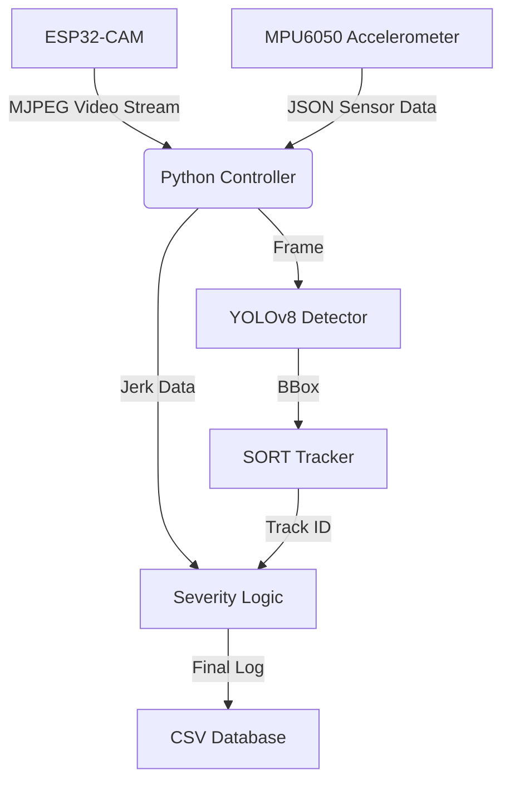

# Intelligent Pothole Detection System (IPDS)


**An advanced IoT + AI solution for real-time road hazard assessment.**

## System Architecture



## Core Logic & Algorithms

### 1. Visual Detection (YOLOv8)
We utilize a custom-trained **YOLOv8** model to identify potholes in the video stream.
-   **Input**: 320x240 RGB Frames.
-   **Output**: Bounding Boxes (x, y, w, h) + Confidence Score.

### 2. Multi-Object Tracking (SORT)
To prevent counting the same pothole multiple times as the camera moves, we use **SORT (Simple Online and Realtime Tracking)**.
<details>
<summary><b>Click to learn how SORT works</b></summary>
SORT uses two key components:
1.  **Kalman Filter**: Predicts the future position of a pothole based on its velocity. If detection is missed for a few frames, the "Ghost" track continues.
2.  **IoU (Intersection over Union)**: Matches new detections to existing tracks.
</details>

### 3. False Positive Rejection (The "Dumper Filter")
We implement strict geometric rules to filter out non-potholes like speed breakers or large dumpers.

| Check | Threshold | Action |
| :--- | :--- | :--- |
| **Area Ratio** | `> 25%` of screen | **REJECT** (Too big, likely a dumper) |
| **Aspect Ratio** | `> 3.0` (Width/Height) | **REJECT** (Too wide, likely a speed breaker) |
| **Persistence** | `> 10` frames (Static) | **REJECT** (Not moving relative to road) |

### 4. Severity Calculation (Sensor Fusion)
This is the heart of the system. We combine **Visual Confidence** with **Physical Vibration**.

> **Formula**: `Severity = 0.7 * (Confidence) + 0.3 * (Normalized Jerk)²`

<details>
<summary><b>View Python Implementation</b></summary>

```python
def calculate_severity(confidence, jerk):
    # Normalize Jerk (0 - 20 m/s³)
    jerk_norm = (jerk - 0.0) / (20.0 - 0.0)
    jerk_norm = max(0.0, min(1.0, jerk_norm)) 
    
    # Weighted Sum
    severity = 0.7 * confidence + 0.3 * (jerk_norm ** 2)
    return round(severity, 2)
```
</details>

## Hardware & Connectivity
The system uses an **ESP32-CAM** acting as a WiFi Server.
-   **Endpoint `/stream`**: Provides high-speed MJPEG video.
-   **Endpoint `/sensors`**: Provides JSON data: `{"ax": 0.1, "lat": 12.34, ...}`.

## How to Run
1.  **Flash Firmware**: Upload `pothole_sensor.ino` to ESP32 (Don't forget WiFi creds!).
2.  **Configure IP**: Update `ESP32_IP` in `src/main.py`.
3.  **Launch**:
    ```bash
    python src/main.py
    ```

---
*Built with love for Safer Roads.*
